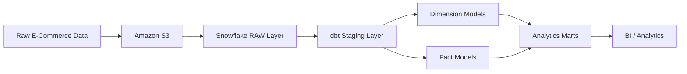

# 🛒 E-Commerce ETL & Analytics Pipeline

An end-to-end **E-Commerce ETL/ELT data pipeline** built using **Amazon S3, Snowflake, dbt, and SQL**.

The project transforms raw E-Commerce data into structured, analytics-ready datasets using modern data engineering and analytics engineering practices.

---

## 🏗️ Architecture



## Pipeline Flow

Raw Data → Amazon S3 → Snowflake → dbt Staging → Dimensions & Facts → Analytics Marts → BI / Analytics

## 📂 Project Structure

```text
hmart/
│
├── analyses/
│   └── customer_revenue_analysis.sql
│
├── models/
│   ├── staging/
│   │   ├── src_customers.sql
│   │   ├── src_products.sql
│   │   ├── src_orders.sql
│   │   ├── src_order_items.sql
│   │   └── src_payments.sql
│   │
│   ├── dimensions/
│   │   ├── dim_customers.sql
│   │   ├── dim_products.sql
│   │   └── dim_dates.sql
│   │
│   ├── facts/
│   │   ├── fct_sales.sql
│   │   └── fct_orders.sql
│   │
│   ├── marts/
│   │   ├── mart_monthly_revenue.sql
│   │   ├── mart_revenue_breakdown.sql
│   │   ├── mart_customer_rfm.sql
│   │   ├── mart_cohort_retention.sql
│   │   ├── mart_product_performance.sql
│   │   ├── mart_coupon_effectiveness.sql
│   │   └── mart_order_status_rates.sql
│   │
│   └── schema.yml
│
├── snapshots/
│   ├── snap_customers.sql
│   └── snap_products.sql
│
├── tests/
│   └── assert_net_amount_not_greater_than_gross.sql
│
├── dbt_project.yml
├── packages.yml
└── README.md
└── README.md
```
---

## 📊 Data Model

The project follows a **dimensional modeling approach** with separate staging, dimension, fact, and analytics layers.

### Staging Layer

The staging layer cleans and standardizes raw source data before it is used downstream.

**Models:**

- `src_customers`
- `src_products`
- `src_orders`
- `src_order_items`
- `src_payments`

### Dimension Layer

#### `dim_customers`

Contains customer attributes including:

- Customer information
- Location
- Gender
- Birth date
- Signup date
- Loyalty tier
- Active status

#### `dim_products`

Contains product attributes including:

- Product name
- Category
- Subcategory
- Brand
- Unit cost
- Unit price
- Weight
- Discontinued status

#### `dim_dates`

Provides reusable calendar attributes including:

- Date
- Year
- Month
- Quarter
- Week
- Day
- Weekend indicator

---

## 📦 Fact Models

### `fct_sales`

Transaction-level sales fact table containing:

- Orders
- Customers
- Products
- Quantities
- Unit prices
- Discounts
- Gross amount
- Net revenue
- Cost
- Gross margin
- Payment method
- Order status

The model uses **incremental materialization** to process new records efficiently.

### `fct_orders`

Aggregates sales transactions at the order level and provides:

- Order information
- Customer information
- Units
- Revenue
- Discounts
- Costs
- Gross margin
- Order status

---

## 📈 Analytics Marts

The project contains business-focused analytical models built on top of the fact and dimension layers.

### 💰 Monthly Revenue

**Model:** `mart_monthly_revenue`

Provides:

- Monthly orders
- Active customers
- Units sold
- Net revenue
- Gross margin
- Discounts
- Average order value
- Margin percentage

### 🌍 Revenue Breakdown

**Model:** `mart_revenue_breakdown`

Breaks down revenue by:

- Product category
- Sales channel
- Country
- Region

### 👥 Customer RFM Analysis

**Model:** `mart_customer_rfm`

Segments customers using:

- **Recency**
- **Frequency**
- **Monetary value**

Customer segments include:

- High Value
- Loyal
- At Risk
- Regular

### 🔄 Cohort Retention

**Model:** `mart_cohort_retention`

Tracks customer activity across monthly cohorts to analyze customer retention over time.

### 📦 Product Performance

**Model:** `mart_product_performance`

Measures:

- Units sold
- Revenue
- Gross margin
- Margin percentage

### 🎟️ Coupon Effectiveness

**Model:** `mart_coupon_effectiveness`

Analyzes:

- Coupon usage
- Revenue
- Average order value
- Discounts
- Gross margin

### 📋 Order Status Analysis

**Model:** `mart_order_status_rates`

Analyzes:

- Order volumes
- Cancellation rates
- Return rates
- Sales channels
- Payment methods

---

## 🔄 dbt Features

### ⚡ Incremental Models

`fct_sales` uses incremental materialization to avoid rebuilding the entire dataset during every run.

```sql
{{ config(
    materialized='incremental',
    unique_key='order_item_id'
) }}
