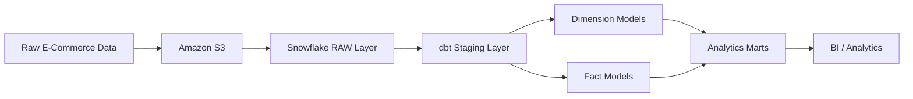

# 🛒 E-Commerce ETL & Analytics Pipeline

An end-to-end **E-Commerce ETL/ELT data pipeline** built using **Amazon S3, Snowflake, dbt, and SQL**.

The project transforms raw E-Commerce data into structured, analytics-ready datasets using modern data engineering and analytics engineering practices.

---

## 🏗️ Architecture



## Pipeline Flow

Raw Data → Amazon S3 → Snowflake → dbt Staging → Dimensions & Facts → Analytics Marts → BI / Analytics

## 📂 Project Structure

```text
hmart/
│
├── analyses/
│   └── customer_revenue_analysis.sql
│
├── models/
│   ├── staging/
│   │   ├── src_customers.sql
│   │   ├── src_products.sql
│   │   ├── src_orders.sql
│   │   ├── src_order_items.sql
│   │   └── src_payments.sql
│   │
│   ├── dimensions/
│   │   ├── dim_customers.sql
│   │   ├── dim_products.sql
│   │   └── dim_dates.sql
│   │
│   ├── facts/
│   │   ├── fct_sales.sql
│   │   └── fct_orders.sql
│   │
│   ├── marts/
│   │   ├── mart_monthly_revenue.sql
│   │   ├── mart_revenue_breakdown.sql
│   │   ├── mart_customer_rfm.sql
│   │   ├── mart_cohort_retention.sql
│   │   ├── mart_product_performance.sql
│   │   ├── mart_coupon_effectiveness.sql
│   │   └── mart_order_status_rates.sql
│   │
│   └── schema.yml
│
├── snapshots/
│   ├── snap_customers.sql
│   └── snap_products.sql
│
├── tests/
│   └── assert_net_amount_not_greater_than_gross.sql
│
├── dbt_project.yml
├── packages.yml
└── README.md
└── README.md
