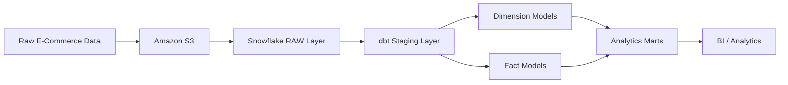

# 🛒 E-Commerce ETL & Analytics Pipeline

An end-to-end **E-Commerce ETL/ELT data pipeline** built using **Amazon S3, Snowflake, dbt, and SQL**.

The project transforms raw E-Commerce data into structured, analytics-ready datasets using modern data engineering and analytics engineering practices.

---

## 🏗️ Architecture

🛠️ Tech Stack
Technology	Purpose
Amazon S3	Raw data storage
Snowflake	Cloud data warehouse
dbt	Data transformation, testing & documentation
SQL	Data transformation & analysis
Git / GitHub	Version control
